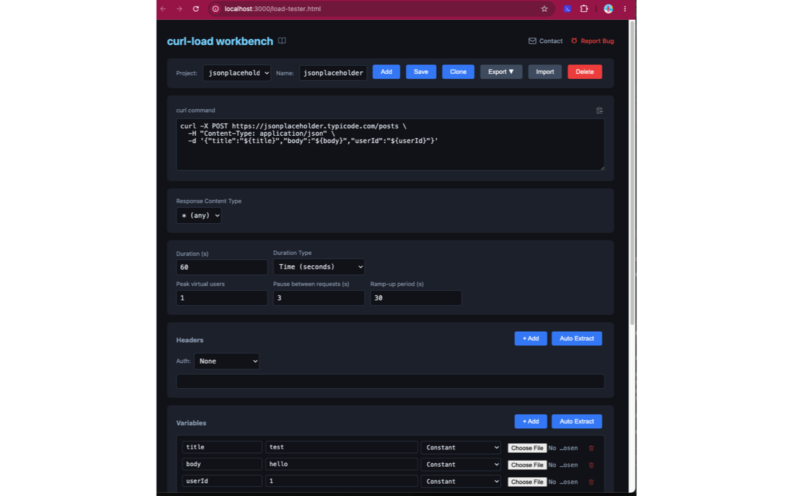

# PerfLoad Support

Welcome to the support repository for **PerfLoad** 🚀

Use this repo to:
- 🐛 Report bugs
- 💡 Request features
- ❓ Ask questions

---

## 🚀 Getting Started

The easiest way to run PerfLoad is via Docker.

### 📦 Prerequisites

- Install Docker: https://docs.docker.com/get-docker/

Verify installation:

```bash
docker --version
```

---

## ▶️ Run PerfLoad

```bash
docker run -d --name perfload \
  -p 3000:3000 \
  -v perfload-runs:/app/runs \
  perfload/perfload-runner:1.4.0
```

| Flag | Description |
|------|-------------|
| `-d` | Run in the background |
| `-p 3000:3000` | Dashboard, API & k6 live dashboard (all on one port) |
| `-v perfload-runs:/app/runs` | Persist run history across restarts |

> To always use the latest release replace `1.4.0` with `latest`.

---

## 🛠️ Managing the container

```bash
# Stop
docker stop perfload

# Start again
docker start perfload

# View logs
docker logs perfload

# Update to a new version
docker stop perfload && docker rm perfload
docker pull perfload/perfload-runner:latest
docker run -d --name perfload -p 3000:3000 -v perfload-runs:/app/runs perfload/perfload-runner:latest
```

> Run history is stored in the `perfload-runs` Docker volume and is preserved when you stop, restart, or upgrade the container.

---

## 🌐 Access the Workbench

Once the container is running, open:

http://localhost:3000/load-tester.html

This is the **PerfLoad Workbench**, where you can:
- Paste curl commands
- Configure load tests
- Run tests locally or remotely



---

## 🔌 Ports

| Port | Description |
|------|------------|
| 3000 | Web UI, API, and k6 live dashboard (all on one port) |

---

## 🧪 Example Usage

1. Open the Workbench
2. Paste a curl command:

```bash
curl -X GET "https://api.example.com/data?limit=10"
```

3. Configure:
    - Virtual Users
    - Duration or Iterations
    - Variables (optional)

4. Click **Run Test**

---

## 🐛 Reporting Issues

When reporting a bug, please include:

- curl command used
- configuration (VUs, duration, etc.)
- expected vs actual behavior
- screenshots (if applicable)

---

## 💡 Feature Requests

We welcome ideas! Please include:
- problem you're trying to solve
- proposed solution
- example use case

---

## 📌 Notes

- Docker is required to run the backend runner
- Some APIs may block browser requests due to CORS
- For best results, run tests against APIs that allow direct access

---

## 🔗 Links

- Workbench: http://localhost:3000/load-tester.html
- Dashboard: http://localhost:3000/
- Documentation: http://localhost:3000/documentation.html

---

## 🧠 About PerfLoad

PerfLoad is a lightweight load testing tool that lets you:
- Use existing curl commands
- Run load tests instantly
- Avoid complex setup

---

## ⭐ Contributing

Feel free to open issues or suggestions — feedback is highly appreciated!
